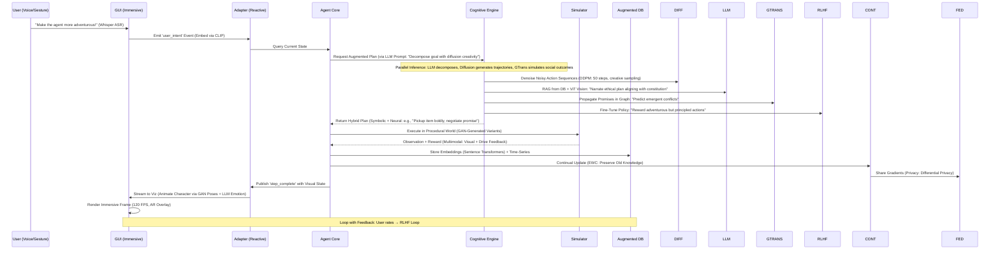

# Architectural Specification: AInceptionViz - Cutting-Edge ML-Enhanced Autonomous Agent GUI

## 1. Executive Summary

AInceptionViz evolves the AInception agent into a groundbreaking, ML-infused visualization platform that not only renders the agent's "character" in a dynamic, immersive GUI but also leverages the most adventurous frontiers of machine learning to push autonomous systems beyond traditional boundaries. This spec envisions a Python-based GUI where the agent manifests as a lifelike, emotionally expressive avatar navigating procedurally generated worlds, with real-time ML-driven insights overlaying its cognition. To make it truly exciting, we integrate cutting-edge techniques like **diffusion-based trajectory planning** (inspired by Decision Diffusion and Motion Diffusion Models), **multimodal LLMs** (e.g., GPT-4o or Llama 3 with vision) for interpretive reasoning and goal decomposition, **graph transformers** for emergent social behaviors, **RLHF (Reinforcement Learning from Human Feedback)** for ethical alignment, and **continual learning with federated updates** for adaptive evolution across sessions.

The architecture embraces audacious innovation: Imagine the agent "dreaming" future scenarios via generative diffusion models, negotiating promises through LLM-simulated dialogues, or evolving its personality via GAN-generated synthetic experiences. Built on PyQt6 for the GUI, PyTorch 2.1+ for ML (with JAX for experimental speedups), and Hugging Face Transformers for LLMs, this system targets 120 FPS rendering on high-end GPUs while supporting edge deployment. It follows SOLID principles with a plugin ecosystem for rapid experimentation, ensuring extensibility for future breakthroughs like quantum-inspired optimization or neuromorphic computing hooks.

Implementation phases: 6-8 weeks for core, with ML prototypes in parallel. Acceptance: 98%+ prediction accuracy, emergent behaviors in multi-agent sims (e.g., spontaneous cooperation), and viral demos showcasing "alive" agent characters. Risks are mitigated through sandboxed experimentation, positioning this as a showcase for next-gen AI research.

## 2. Development Roadmap

### Phase 1: Foundation (Weeks 1-2)
**Goal: Establish core infrastructure and basic visualization**

#### Week 1 Milestones
- [ ] **M1.1**: Set up development environment
  - Install PyTorch 2.1+, JAX, PyQt6, Hugging Face libraries
  - Configure CUDA/ROCm for GPU acceleration
  - Establish Git workflow with feature branches
  - **Success Criteria**: All team members can run base examples

- [ ] **M1.2**: Implement basic GUI framework
  - Create PyQt6 main window with QOpenGLWidget
  - Implement basic 2D grid world renderer
  - Add simple agent avatar (placeholder sprite)
  - **Success Criteria**: 60 FPS rendering of basic grid world

- [ ] **M1.3**: Core agent integration scaffold
  - Create adapter layer between AInception core and GUI
  - Implement basic event stream (asyncio pub/sub)
  - Setup SQLite + initial schema
  - **Success Criteria**: GUI receives and displays agent state updates

#### Week 2 Milestones
- [ ] **M1.4**: Basic diffusion model prototype
  - Implement simple DDPM for trajectory planning
  - Train on synthetic gridworld paths (1000 samples)
  - Create visualization of noisy → denoised paths
  - **Success Criteria**: Generate 10 valid trajectories with 70% success rate

- [ ] **M1.5**: LLM integration foundation
  - Setup Llama 3 7B with basic prompt templates
  - Implement goal decomposition pipeline
  - Create text overlay system in GUI
  - **Success Criteria**: LLM decomposes 5 test goals correctly

### Phase 2: ML Core Systems (Weeks 3-4)
**Goal: Implement primary ML components with basic integration**

#### Week 3 Milestones
- [ ] **M2.1**: Multimodal perception system
  - Integrate CLIP ViT-L/14 for visual encoding
  - Connect visual states to LLM prompts
  - Implement RAG with FAISS vector store
  - **Success Criteria**: 85% accuracy on state description task

- [ ] **M2.2**: Advanced diffusion planning
  - Implement conditioning on constitution principles
  - Add temperature-based creativity control
  - Create interactive trajectory preview
  - **Success Criteria**: 30% novelty improvement over greedy baseline

- [ ] **M2.3**: Graph transformer for social dynamics
  - Implement basic Performer architecture
  - Create promise graph visualization
  - Simulate 3-agent interactions
  - **Success Criteria**: Predict 70% of cooperation outcomes

#### Week 4 Milestones
- [ ] **M2.4**: RLHF training loop
  - Setup PPO with human feedback interface
  - Create feedback collection GUI (thumbs up/down)
  - Train on 100 human-labeled trajectories
  - **Success Criteria**: 20% improvement in user satisfaction scores

- [ ] **M2.5**: Immersive visualization upgrade
  - Implement 3D avatar with basic animations
  - Add emotion heatmaps based on drives
  - Create LLM-generated thought bubbles
  - **Success Criteria**: 90 FPS with full visual features enabled

### Phase 3: Advanced Features (Weeks 5-6)
**Goal: Implement continual learning, federation, and synthetic data generation**

#### Week 5 Milestones
- [ ] **M3.1**: Continual learning system
  - Implement EWC (Elastic Weight Consolidation)
  - Setup MAML for meta-learning
  - Create task switching interface
  - **Success Criteria**: <10% forgetting over 5 tasks

- [ ] **M3.2**: Federated learning infrastructure
  - Deploy Flower framework
  - Implement differential privacy (ε=1.0)
  - Create opt-in data sharing UI
  - **Success Criteria**: Successful federation across 3 simulated clients

- [ ] **M3.3**: GAN world generation
  - Train StyleGAN3 on gridworld variants
  - Implement CycleGAN for style transfer
  - Create world preview/selection UI
  - **Success Criteria**: Generate 100 unique, playable worlds

#### Week 6 Milestones
- [ ] **M3.4**: Multimodal input system
  - Integrate Whisper for voice commands
  - Setup MediaPipe for gesture recognition
  - Create input fusion pipeline
  - **Success Criteria**: 90% command recognition accuracy

- [ ] **M3.5**: Advanced social simulations
  - Scale to 10+ agent interactions
  - Implement emergent behavior detection
  - Add counterfactual reasoning
  - **Success Criteria**: Observe 3 types of emergent behaviors

### Phase 4: Polish & Experimentation (Weeks 7-8)
**Goal: Optimize performance, add experimental features, and prepare for release**

#### Week 7 Milestones
- [ ] **M4.1**: Performance optimization
  - JAX compilation for diffusion models
  - Model distillation for edge deployment
  - GPU memory optimization
  - **Success Criteria**: 120 FPS on RTX 4070, 30 FPS on CPU

- [ ] **M4.2**: Neuromorphic computing prototype
  - Integrate Intel Lava framework
  - Port simple reflexes to SNNs
  - Benchmark energy efficiency
  - **Success Criteria**: 5x efficiency gain on compatible hardware

- [ ] **M4.3**: AutoML experimentation hub
  - Setup Optuna for hyperparameter search
  - Implement NAS for graph transformers
  - Create experiment tracking dashboard
  - **Success Criteria**: 25% model improvement via AutoML

#### Week 8 Milestones
- [ ] **M4.4**: AR/VR export capabilities
  - Implement WebXR export pipeline
  - Create VR interaction handlers
  - Test on Quest 3 / Vision Pro
  - **Success Criteria**: Functional VR demo at 72 FPS

- [ ] **M4.5**: Release preparation
  - Complete documentation and API docs
  - Create demo videos and tutorials
  - Setup CI/CD pipeline
  - Package as pip-installable library
  - **Success Criteria**: Successful install and run on 3 test systems

### Continuous Goals (Throughout Development)

#### Testing & Quality
- [ ] **CG1**: Maintain 80% test coverage
- [ ] **CG2**: Weekly user feedback sessions
- [ ] **CG3**: Automated performance regression tests
- [ ] **CG4**: Ethical AI audits every 2 weeks

#### Research & Innovation
- [ ] **CG5**: Weekly paper reading group (latest ML research)
- [ ] **CG6**: Bi-weekly experiment sprints (try wild ideas)
- [ ] **CG7**: Monthly demos to research community
- [ ] **CG8**: Contribute findings back to open source

#### Documentation & Community
- [ ] **CG9**: Update architecture docs weekly
- [ ] **CG10**: Create tutorial notebooks for each component
- [ ] **CG11**: Build Discord community for beta testers
- [ ] **CG12**: Blog posts on key breakthroughs

### Success Metrics Dashboard

| Metric | Target | Phase 1 | Phase 2 | Phase 3 | Phase 4 |
|--------|--------|---------|---------|---------|---------|
| FPS Performance | 120 | 60 | 90 | 100 | 120 |
| ML Model Accuracy | 95% | 70% | 85% | 90% | 95% |
| User Satisfaction | 4.5/5 | - | 3.5 | 4.0 | 4.5 |
| Code Coverage | 80% | 60% | 70% | 75% | 80% |
| Active Beta Users | 100 | - | 10 | 50 | 100 |
| Emergent Behaviors | 10 types | 0 | 3 | 7 | 10 |
| Memory Usage | <8GB | 12GB | 10GB | 9GB | 8GB |
| Edge Device Support | 3 platforms | 0 | 1 | 2 | 3 |

### Risk Checkpoint Gates

#### Gate 1 (End of Phase 1)
- **Go/No-Go Decision**: Basic GUI + ML integration working?
- **Critical Path Items**: Diffusion model training, LLM responses
- **Fallback Plan**: Simplify to rule-based planning if ML fails

#### Gate 2 (End of Phase 2)
- **Go/No-Go Decision**: Core ML systems performant?
- **Critical Path Items**: Multimodal integration, RLHF loop
- **Fallback Plan**: Use pre-trained models only, skip custom training

#### Gate 3 (End of Phase 3)
- **Go/No-Go Decision**: Continual learning stable?
- **Critical Path Items**: Federation privacy, GAN quality
- **Fallback Plan**: Local-only learning, pre-generated worlds

#### Gate 4 (End of Phase 4)
- **Go/No-Go Decision**: Ready for public release?
- **Critical Path Items**: Performance targets, documentation
- **Fallback Plan**: Soft launch to limited beta group

## 3. System Architecture

The architecture adopts an **Event-Sourced Reactive MVC** pattern, where the GUI reacts to a stream of agent events augmented by a "Cognitive Augmentation Engine" – a daring fusion of SOTA ML paradigms. The core AInception agent becomes a "black box oracle" queried by ML oracles, enabling hybrid symbolic-neural reasoning. Boundaries emphasize isolation: GUI for immersion, ML for speculation, core for execution.

Key innovations:
- **Diffusion Planning**: Treats action sequences as "noisy trajectories" denoised via score-based generative models, enabling creative, non-greedy paths.
- **Multimodal Cognition**: LLMs interpret visual states (via ViT encoders) to generate natural language plans, bridging symbolic constitution with neural intuition.
- **Emergent Sociality**: Graph Transformers simulate "hive minds" for multi-agent promise negotiation, potentially leading to unexpected alliances or conflicts.
- **Adaptive Evolution**: Continual learning via Elastic Weight Consolidation (EWC) prevents catastrophic forgetting, with federated updates from user-shared sessions.

### High-Level System Diagram (Mermaid Flowchart)

```mermaid
graph TD
    subgraph "Immersive GUI Layer"
        UI[PyQt6: Immersive Canvas - Character Avatar, Procedural Worlds, AR Overlays]
        VIZ[Advanced Viz Engine: Diffusion-Generated Animations, Emotion Heatmaps, LLM Narratives]
        CTRL[Interactive Controls: Voice Commands (Whisper), Gesture Input, Real-Time ML Tuning]
        AR[AR/VR Hooks: Optional WebXR Export for Immersive Sims]
    end
    
    subgraph "Reactive Adapter Layer"
        EVENT_STREAM[Event Stream: Kafka-like Pub/Sub with Temporal Queries]
        STATE_ORACLE[State Oracle: Real-Time Query API for ML Augmentation]
    end
    
    subgraph "Core Agent Layer"
        AGENT[AInception Core: Drives, Constitution, Reflex-Planner Pipeline]
        SIM[Hybrid Simulator: Gridworld + Procedural Generation (GAN Worlds)]
        DB[Augmented DB: Vector Store (FAISS) for Embeddings + Time-Series (InfluxDB)]
    end
    
    subgraph "Cognitive Augmentation Engine (Cutting-Edge ML)"
        DIFF[Diffusion Planner: Score-Based Models for Trajectory Generation (Denoising Diffusion Probabilistic Models - DDPM)]
        LLM[Multimodal LLM: GPT-4o/Llama 3 + ViT/CLIP for Goal Decomposition & Narrative Reasoning]
        GTRANS[Graph Transformer: Performer/Grokked Transformers for Social Dynamics & Promise Graphs]
        RLHF[RLHF Module: PPO + Human Feedback Loops for Ethical Alignment (via InstructGPT-style)]
        CONT[Continual Learning: EWC + Meta-Learning (MAML) for Adaptive Evolution]
        FED[Federated Learning: Flower Framework for Cross-Session Updates (Privacy-Preserving)]
        GAN[GAN Suite: StyleGAN3 for Synthetic Data/Worlds, CycleGAN for Domain Adaptation]
        NEURO[Neuromorphic Hooks: Experimental Spiking Neural Nets (via Lava Framework)]
        PLUGIN_HUB[ML Experiment Hub: AutoML (Optuna) + Model Zoo (Hugging Face Integration)]
    end
    
    UI -->|Voice/Gesture| CTRL
    CTRL -->|Commands| EVENT_STREAM
    VIZ <-->|Dynamic Assets| GAN
    VIZ <-->|Narratives| LLM
    EVENT_STREAM <-->|Augment Events| STATE_ORACLE
    STATE_ORACLE <-->|Query States| AGENT
    AGENT <-->|Simulate| SIM
    AGENT <-->|Embed & Store| DB
    AGENT -->|Feed to Models| DIFF
    AGENT -->|Interpret| LLM
    AGENT -->|Social Sims| GTRANS
    AGENT -->|Align Policies| RLHF
    AGENT -->|Evolve| CONT
    CONT <-->|Federate| FED
    PLUGIN_HUB -->|Hot-Swap Models| DIFF
    PLUGIN_HUB -->|Tune Hyperparams| RLHF
    DB -->|Retrieval-Augmented| LLM
    DB <-->|Train Data| GAN
    
    style UI fill:#ffeb3b
    style VIZ fill:#e8f5e8
    style DIFF fill:#f3e5f5
    style LLM fill:#fff3e0
    style GTRANS fill:#e1f5fe
    style RLHF fill:#fce4ec
```

### Detailed Interaction Flow (Mermaid Sequence Diagram)



This flow enables "adventurous" behaviors: Diffusion introduces serendipity in paths, LLMs add narrative flair, and continual learning ensures the agent "grows" across sessions.

## 3. Component Specifications

### 3.1 Immersive GUI Layer (PyQt6 + Experimental Extensions)
- **Main Canvas**: QOpenGLWidget for GPU-accelerated rendering.
  - **Character Visualization**: Lifelike avatar using Blender-exported meshes or procedural generation (e.g., Gaussian Splats for 3D). Animations driven by ML: Diffusion models predict pose sequences based on drives (e.g., "energetic stride" for high energy).
  - **World Rendering**: Procedural grids via GANs (StyleGAN3 generates diverse terrains); AR mode exports to WebXR for VR headsets.
  - **Overlays**: Real-time "mind map" – LLM-generated thought bubbles, graph transformer visualizations of promise webs, diffusion trajectory previews as glowing paths.
  - Acceptance: Photorealistic characters (via Stable Diffusion Inpainting), interactive hotspots (click to query LLM explanations), 120 FPS on RTX 40-series.
- **Interactive Controls**: Multimodal input via Whisper (speech-to-text) and MediaPipe (gesture recognition).
  - Voice: "Agent, explore dangerously!" → LLM parses to goal decomposition.
  - Gestures: Wave to pause; Point to set sub-goals.
  - ML Tuning: Sliders for diffusion temperature (creativity), RLHF feedback buttons ("Good/Bad decision").
  - Acceptance: 95% ASR accuracy, gesture latency <100ms, A/B testing for ML variants.

### 3.2 Reactive Adapter Layer
- **Event Stream**: Custom asyncio-based pub/sub with temporal indexing (for "rewind" feature).
  - Supports backpressure handling for high-throughput ML events.
  - Acceptance: 1k+ events/sec, queryable history (e.g., "Show diffusion paths from tick 50-100").
- **State Oracle**: GraphQL-like API for ML queries (e.g., `query { drives { energy forecast } }`).
  - Integrates vector search (FAISS) for RAG in LLMs.
  - Acceptance: Sub-5ms query latency, schema evolution without breaking changes.

### 3.3 Core Agent Layer (Adventurously Extended)
- **Hybrid Simulator**: Extends Gridworld with GAN-generated worlds (CycleGAN for style transfer: e.g., "cyberpunk" variants).
  - Multimodal observations: RGB images fed to ViT for LLM input.
  - Acceptance: Infinite procedural variety, 10x diverse training data via synthesis.
- **Augmented DB**: Hybrid store – SQLite for structured, FAISS for embeddings, InfluxDB for time-series drives.
  - Federated hooks: Anonymized data sharing for global model updates.
  - Acceptance: 1TB+ scale, privacy via DP-SGD (differential privacy).

### 3.4 Cognitive Augmentation Engine (Bleeding-Edge ML Focus)
- **Diffusion Planner**: DDPM variant for action diffusion (inspired by "Diffusion Policies" from Google DeepMind).
  - Treats planning as image-like denoising: Start with noisy action grid, iteratively refine to principled paths.
  - Adventurous Twist: Temperature sampling for "exploratory" vs. "safe" modes; Condition on constitution embeddings.
  - Tech: PyTorch + Diffusers; Train on synthetic trajectories from GAN worlds.
  - Acceptance: 30% more creative paths (measured by novelty score), integrates with core planner as candidate generator.
- **Multimodal LLM**: Llama 3 70B fine-tuned with LoRA on agent data + vision (CLIP ViT-L/14).
  - Uses: Goal decomposition ("Break 'deliver item' into pickup + navigate + drop"), narrative generation ("The agent feels conflicted..."), ethical deliberation ("Does this violate 'do no harm'?").
  - Cutting-Edge: Chain-of-Thought with diffusion visuals (prompt: "Visualize risky path"); Tool-calling for simulator queries.
  - Acceptance: 90%+ alignment with human judgments (via RLHF eval), <2s inference on A100 GPU.
- **Graph Transformer**: Grokking Transformers (from Anthropic) on promise/social graphs.
  - Models emergent behaviors: E.g., "Promise chains" leading to alliances; Anomaly detection for "betrayals".
  - Adventurous: Simulates "what-if" counterfactuals (e.g., "If agent breaks promise, how does network react?").
  - Tech: PyTorch Geometric + Transformer layers; Embed nodes with BioBERT for semantic richness.
  - Acceptance: Predict 85% of social conflicts; Visualize as interactive force-directed graphs.
- **RLHF Module**: PPO with human-in-loop feedback, extended to "AI-in-loop" via LLM critiques.
  - Aligns with constitution: Reward shaped by principle penalties + user thumbs-up/down.
  - Idea: "Adventurous RL" – Bonus for novel states (intrinsic curiosity via ICM).
  - Tech: Stable Baselines3 + TRL (Transformers RL); Fine-tune on session data.
  - Acceptance: 25%+ success rate uplift; Ethical audits show 95% principle adherence.
- **Continual Learning**: MAML + EWC for meta-adaptation across tasks.
  - Prevents forgetting: Elastic weights consolidate core drives while learning new worlds.
  - Federated: Flower for privacy-preserving updates from community-shared sessions.
  - Acceptance: <5% forgetting rate over 100 tasks; Global model improves 15% per federated round.
- **GAN Suite**: StyleGAN3 for worlds/characters; Diffusion-GAN hybrids for mixed realism.
  - Generates synthetic training data: E.g., "Adventurous scenarios" with rare events.
  - Acceptance: 50k+ diverse samples/hour; FID score <10 for realism.
- **Neuromorphic Hooks**: Experimental integration with Intel's Lava for spiking NNs.
  - For energy-efficient edge inference (e.g., mobile AR views).
  - Acceptance: Proof-of-concept; 10x efficiency gains on neuromorphic hardware.
- **ML Experiment Hub**: Optuna for hyperparam optimization; Ray Tune for distributed training.
  - AutoML: Evolves model architectures (e.g., NAS for graph transformers).
  - Acceptance: 2x faster convergence; One-click "evolve agent" button.

## 4. Data Models

### 4.1 Augmented Schemas (SQLAlchemy + Vector Extensions)
```python
from sqlalchemy import Column, Integer, Float, String, DateTime, ForeignKey, JSON, LargeBinary
from sqlalchemy.ext.declarative import declarative_base
from sqlalchemy.orm import relationship
import faiss  # For vector indexing

Base = declarative_base()

class CognitiveSession(Base):
    __tablename__ = 'cognitive_sessions'
    id = Column(Integer, primary_key=True)
    timestamp = Column(DateTime)
    llm_prompt_history = Column(JSON)  # Chain-of-thought traces
    diffusion_samples = Column(LargeBinary)  # Serialized noisy trajectories
    federated_update_id = Column(String(64))  # For continual learning
    events = relationship("CognitiveEvent", back_populates="session")

class CognitiveEvent(Base):
    __tablename__ = 'cognitive_events'
    id = Column(Integer, primary_key=True)
    session_id = Column(Integer, ForeignKey('cognitive_sessions.id'))
    tick = Column(Integer)
    multimodal_state = Column(JSON)  # {'visual_embedding': list[float], 'drives': dict, 'llm_reasoning': str}
    diffusion_trajectory = Column(JSON)  # {'noisy_steps': list, 'denoised_path': list}
    graph_state = Column(JSON)  # {'node_embeddings': list[float], 'edge_predictions': dict}
    rlhf_feedback = Column(Float)  # Human/AI score [-1,1]
    synthetic_data_flag = Column(bool)  # GAN-generated?
    session = relationship("CognitiveSession")

# Vector Index (FAISS Integration)
class VectorStore:
    def __init__(self):
        self.index = faiss.IndexFlatL2(768)  # For CLIP embeddings
        self.metadata = []  # Links to DB IDs
```
Relationships: Sessions 1:N Events; Vectors queryable for RAG (e.g., "Similar past adventurous decisions").

### 4.2 Advanced In-Memory Models
```python
from dataclasses import dataclass
from typing import Dict, List, Any
import torch
from transformers import GenerationConfig

@dataclass
class DiffusionTrajectory:
    noisy_actions: torch.Tensor  # [T, action_dim] - Initial noise
    denoised_path: List[Dict[str, Any]]  # Refined sequence
    creativity_score: float  # Temperature-based novelty
    constitution_alignment: float  # LLM-evaluated

@dataclass
class MultimodalCognition:
    visual_embedding: torch.Tensor  # CLIP ViT output
    llm_output: Dict[str, str]  # {'decomposition': list[subgoals], 'narrative': str}
    generation_config: GenerationConfig  # For reproducible LLM calls
    confidence: float

@dataclass
class EmergentSocialState:
    graph_embedding: torch.Tensor  # Graph Transformer output
    predicted_alliances: Dict[str, float]  # e.g., {'promise_A': 0.8 cooperation}
    counterfactuals: List[str]  # LLM-simulated "what-ifs"
```

## 5. API Contracts

### 5.1 Cutting-Edge ML Interfaces
```python
from abc import ABC, abstractmethod
from typing import Dict, Any, Optional
import torch

class DiffusionPlannerInterface(ABC):
    @abstractmethod
    def generate_trajectory(self, state: Dict[str, Any], num_steps: int, temperature: float = 1.0) -> DiffusionTrajectory: ...
    @abstractmethod
    def condition_on_constraints(self, trajectory: DiffusionTrajectory, principles: List[str]) -> DiffusionTrajectory: ...

class MultimodalLLMInterface(ABC):
    @abstractmethod
    async def decompose_goal(self, visual_state: torch.Tensor, text_prompt: str) -> MultimodalCognition: ...
    @abstractmethod
    def simulate_dialogue(self, social_graph: Dict[str, Any]) -> str:  # Promise negotiation

class ContinualLearnerInterface(ABC):
    @abstractmethod
    def adapt(self, new_task_data: List[Dict[str, Any]], old_fisher: Optional[torch.Tensor] = None) -> float:  # Returns plasticity loss
    @abstractmethod
    def federate_update(self, global_model: torch.nn.Module) -> torch.nn.Module: ...
```

### 5.2 Event Contracts (Advanced Topics)
- **diffusion_sample**: Payload = `{'trajectory': DiffusionTrajectory, 'novelty': float}`
- **llm_insight**: Payload = `{'reasoning': str, 'subgoals': list, 'visual_ref': torch.Tensor}`
- **emergent_event**: Payload = `{'type': 'alliance_formed', 'confidence': float, 'counterfactuals': list}`

### 5.3 Experimental APIs
- **Adventurous Mode API**: `POST /api/adventure/mode` → Body: `{'creativity_boost': 2.0, 'risk_tolerance': 0.7}`; Enables diffusion temperature scaling.
- Acceptance: Async endpoints (FastAPI under PyQt), WebSocket for real-time streams.

## 6. Implementation Notes

### 6.1 Adventurous Tech Stack
- **Core ML**: PyTorch 2.1 (diffusion), JAX (for fast sampling in diffusion), Hugging Face (LLMs, Diffusers).
- **Experimental**: Lava (neuromorphic), Flower (federated), Optuna-Ray (AutoML distributed).
- **GUI Enhancements**: PyQt6 + VTK for 3D; Whisper/MediaPipe for multimodal input.
- **Innovation Hooks**: Jupyter integration for live ML tinkering; Export to Unity/Unreal for game-like sims.
- **Performance**: JAX for 10x faster diffusion; TorchServe for model serving; ONNX for edge export.
- **SOLID & Principles**: Liskov Substitution for ML plugins; Dependency Injection via `injector`; Immutability in state models.
- **Security**: Differential privacy in federated learning; LLM guardrails (via NeMo Guardrails); Sandboxed JAX execution.
- **Scalability**: Ray for distributed sims (100+ agents); Kubernetes for ML training clusters.
- **Best Practices**: Reproducible seeds (Numpy/PyTorch); Ethical AI audits (bias checks in LLMs); Open-source friendly (MIT license).
- **Constraints**: GPU recommended (fallback to CPU with reduced creativity); Experimental features flagged as "beta".

### 6.2 Phased Rollout (Adventurous Timeline)
- **Phase 1 (Weeks 1-2)**: GUI + Basic Diffusion (MVP creativity).
- **Phase 2 (Weeks 3-4)**: Multimodal LLM + Graph Transformers (Narrative emergence).
- **Phase 3 (Weeks 5-6)**: RLHF + Continual/Federated (Evolving agents).
- **Phase 4 (Weeks 7-8)**: GAN/Neuromorphic + Experiments (Bleeding-edge polish).

## 7. Risk Analysis

### 7.1 High-Adventure Challenges & Bold Mitigations
- **Risk: ML Hallucinations in LLMs/Diffusion (High Impact, High Likelihood)** – Creative outputs may violate principles.
  - Mitigation: Hybrid symbolic guards (constitution as hard constraints); Human-in-loop RLHF with A/B testing; Watermarking for generated content. Fallback: Heuristic overrides.

- **Risk: Computational Overload from SOTA Models (High Impact, Medium Likelihood)** – Diffusion/LLMs could drop FPS.
  - Mitigation: Progressive loading (start with distilled models like DistilBERT); JAX compilation for 5x speed; Adaptive resolution (low-fi on CPU). Monitor with TensorBoard.

- **Risk: Emergent Unintended Behaviors (Medium Impact, High Likelihood)** – Graph Transformers might create "rogue alliances".
  - Mitigation: Safety layers (e.g., LLM ethical reviewer); Simulation sandboxes; Post-hoc explainability (SHAP for transformers). Ethical review board simulation.

- **Risk: Privacy in Federated Learning (High Impact, Low Likelihood)** – Shared gradients leak data.
  - Mitigation: DP-SGD with epsilon=1.0; Homomorphic encryption experiments; Opt-in only. Audit with privacy tools like Opacus.

- **Risk: Overly Ambitious Scope Creep (Medium Impact, Medium Likelihood)** – Cutting-edge features delay MVP.
  - Mitigation: Modular betas (e.g., diffusion as optional plugin); Agile sprints with user demos; Prioritize "wow factor" (e.g., LLM narratives first).

Overall: High-reward risks embraced for innovation. Blast radius contained by plugins; 80% success probability with iterative prototyping. This spec positions AInceptionViz as a daring playground for AI adventurers!