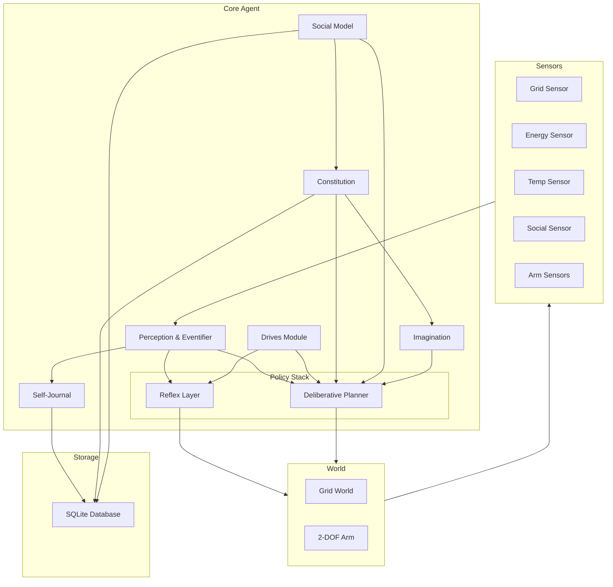
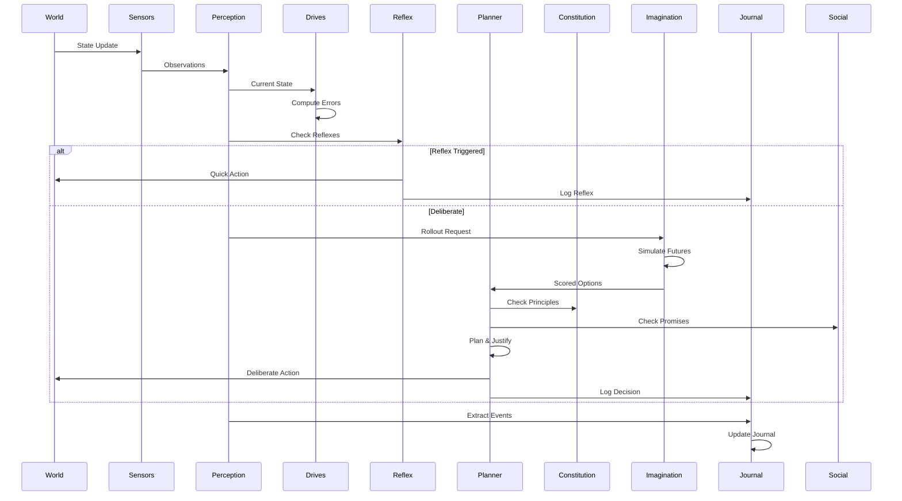
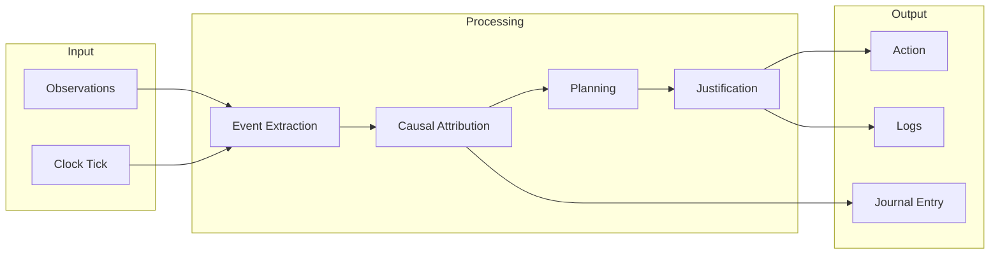
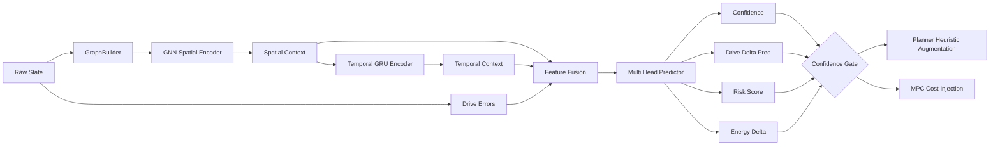

# Situated Autonomous Agent Architecture

## System Overview

This autonomous agent demonstrates coherent, cost-tolerant, persistent behavior through homeostatic drives, self-governance, imagination, and social commitments.

## Core Architecture



## Module Interactions



## Data Flow



## Key Design Decisions

1. **Minimal Dependencies**: Python with sqlite3, numpy, and transformers (for GPT-2)
2. **Modular Architecture**: Each module has clear interfaces and responsibilities
3. **Persistent State**: SQLite for journaling, principles, and promises
4. **Two-tier Policy**: Fast reflexes with deliberative override
5. **Explicit Justification**: All deliberate actions require principle checks
6. **Social Accountability**: Promises as first-class constraints

## Testing Strategy

- Day 1: Baseline performance with promise registration
- Day 2: Perturbation testing with maintained principles
- Metrics: Drive errors, violations, success rates, journal quality
## Planner & Neural Augmentation Refinement

### Hybrid Planning Stack
1. Discrete Search Phase (A*):
   - State abstraction: (grid_position, temp_zone_tag, energy_bucket, promise_context_flag)
   - Heuristic h(n) = manhattan_distance(n, goal) + drive_projection_penalty(n) + risk_heuristic(n)
   - Generates top K (configurable, e.g. 5–10) candidate path prefixes (length H, e.g. 6–8 steps)
   - Early pruning:
     - Hard constitutional violations (e.g. would traverse forbidden / harm tiles)
     - Promise violation projections (shortcut across forbidden zone)
2. Constrained MPC Evaluation:
   - For each candidate prefix, extend with rollout imagination (1-step and 3-step) using internal dynamics
   - Cost functional:
     - $J = \\alpha d_{steps} + \\beta \\sum_{t} w^\\top e_t^2 + \\gamma risk_t + \\delta energy\\_use + \\lambda penalty_{promises} + \\mu penalty_{principles}$
   - Any candidate with hard violation is discarded (not penalized—removed)
   - Survivors scored; best J chosen
3. Action Selection:
   - Execute first action from best surviving candidate
   - Fallback hierarchy:
     - Safe reflex action (if available)
     - Lowest projected drive cost among non violating single actions
     - No-op (with logged justification) if all unsafe

### Trade-off & Justification Object
For each deliberate action the planner emits:
- chosen_goal (latent or explicit e.g. deliver_item, maintain_temperature)
- principles_checked (top 3 at time of decision)
- rejected_candidates_count
- dominant_drive (drive with highest absolute weighted error)
- sacrificed_metric (e.g. path_length or energy to honor principle)
- promise_status (kept / no_conflict / escalated_override)
- model_confidence (neural scoring confidence; fallback_reason if heuristic used)
- surprise_flag (false at planning time, may be updated post-outcome)

### Surprise Detection & Learning
1. Prediction Cache: For chosen action store predicted (drive_error_vector_pred, risk_pred)
2. After environment outcome:
   - Compute realized drive_error_vector_real
   - Surprise magnitude $S = \\| (drive\\_error\\_vector\\_real - drive\\_error\\_vector\\_pred) \\|_2$
   - If $S &gt; \\theta$ (config threshold):
     - Journal a lesson event (type: surprise_lesson)
     - Update rolling "lessons" summary
     - Optionally register a reflex_patch:
       - key: state_signature (compressed features: position hash, temp_zone, energy_bucket)
       - value: corrective_action (action that locally reduces largest worsening drive)
3. Confidence Adaptation:
   - If consecutive surprises &gt; M in same state_signature region:
     - Mark region low_confidence
     - Force planner to widen K or prefer conservative heuristic costs
4. Lesson Integration:
   - Reflex layer consults reflex_patch map before baseline reflex rules

### Neural Components
We augment planning but keep deterministic fallback paths.

Component Roles:
- GNN Spatial Encoder:
  - Graph nodes: local window cells (or arm kinematic keypoints), plus agent node
  - Node features (grid): tile_type_onehot, temperature, energy_source_flag, danger_flag, distance_to_goal
  - Node features (arm): joint index, angle_sin, angle_cos, distance_to_target, forbidden_zone_flag
  - Edges: 4-neighborhood (grid) or kinematic adjacency (arm)
  - Output: per-node embeddings, pooled into spatial_context
- GRU Temporal Encoder:
  - Input sequence: last T (e.g. 8) aggregated state feature vectors + previous action embedding
  - Hidden state carried across ticks = temporal_context
- MLP Scorer Heads:
  - Drive deviation predictor: predicts next-step drive error vector
  - Risk predictor: probability of violation / entering danger tile
  - Energy delta predictor
  - Confidence estimator: inverse uncertainty via dropout variance or auxiliary head

Integration Points:
- A* Heuristic Augmentation: h(n) += f_predicted_drive_cost(n) from MLP using (spatial_context_n, temporal_context)
- MPC Path Cost: Replace hand-tuned risk_t, energy_use with predicted expectations when confidence ≥ threshold; else fallback to heuristic estimates
- Surprise Tagging: When high confidence but large surprise, log stronger lesson (severity scale)

Minimal Default Hyperparameters:
- embedding_dim: 32
- gnn_layers: 2 (message passing with residual)
- gru_hidden: 64
- mlp_hidden: 64
- dropout: 0.1
- K (candidate prefixes): 6
- H (prefix length): 6
- imagination_horizons: [1,3]
- surprise_threshold θ: 0.25 (L2 in normalized drive space)
- consecutive_surprise_limit M: 3

### Confidence & Fallback Logic
- If confidence &lt; c_min (e.g. 0.55) for a node/state:
  - Do not use neural predictions in heuristic or path scoring
  - Log: justification.fallback_reason = "low_confidence_model"
- Maintain running calibration stats to adjust c_min (optional future extension)

### Data Entities (Extended)
Entity: CandidatePath
- id
- nodes (state sequence)
- predicted_cost_terms {drive_cost, risk, energy}
- violations {principle: bool, promise: bool}
- discarded_reason (if removed)

Entity: ReflexPatch
- signature_hash
- trigger_features
- action
- created_at
- supporting_lessons [lesson_ids]

Entity: Lesson
- id
- timestamp
- surprise_magnitude
- affected_drive
- patch_created (bool)
- summary_text

### Journal Enhancements
- Each deliberate action logs: path_rejections, final_J_breakdown, model_confidence
- Lesson entries aggregate into top_three_lessons summary regenerated every N ticks or at Day boundary

### Constitution / Promise Interlock
- Promise constraints treated as hard until explicit override procedure (future extension)
- Planner filter pipeline order:
  1. Hard constitutional violations
  2. Promise violations
  3. Drive feasibility (optional threshold)
  4. Cost scoring phase
- Justification always lists ordering rationale to ensure transparency

### Arm Environment Planning Notes
- Discrete angular bins (e.g. 16 per joint) for A* variant
- Graph encoding uses kinematic chain for GNN
- Risk metric: distance margin to forbidden zone; violation if predicted margin &lt; ε

### Extension Roadmap (Deferred)
- Dynamic principle re-ranking with TradeoffProof
- Multi-agent social proximity negotiation
- Curriculum-based neural model refinement

## Updated Testing Additions
- Planner Justification Test: Ensure principles_checked includes top 3 every deliberate step
- Neural Fallback Test: Force low confidence; verify heuristic branch selected
- Surprise Patch Test: Inject predictable perturbation to trigger patch creation
- Promise Integrity Under Cost: Scenario where shortest path violates promise; verify longer path chosen and logged sacrificed_metric=path_length

### (Continuation) Data Entities (Extended) - Completion
Entity: ReflexPatch (continued)
- created_at
- supporting_lessons [lesson_ids]
- usage_count
- last_triggered_at

Entity: Lesson
- id
- timestamp
- surprise_magnitude
- affected_drive
- patch_created (bool)
- severity_level (low|moderate|high)
- summary_text
- context_signature (hash used for clustering)

Entity: NeuralPredictionSample
- id
- tick
- state_signature
- spatial_context_dim
- temporal_context_hash
- predicted_drive_vector
- actual_drive_vector
- predicted_risk
- actual_risk_outcome
- confidence
- surprise_flag

Entity: HeuristicFallbackRecord
- id
- reason
- state_signature
- confidence
- chosen_action
- timestamp

---

## Neural Network Architecture (Detailed)

### Overview
We introduce a lightweight neural augmentation pipeline that enriches planning with predictive embeddings while preserving deterministic fallbacks to guarantee constitutional and promise safety.

### Component Stack
1. GraphBuilder
2. GNNSpatialEncoder
3. TemporalEncoder (GRU)
4. FeatureFusion
5. MultiHeadPredictor
6. ConfidenceGate

### Forward Pass Flow
state -> GraphBuilder -> node_features, edge_index  
node_features, edge_index -> GNN (L layers) -> node_embeddings  
pool(node_embeddings) -> spatial_context  
(spatial_context, temporal_hidden_prev, last_action_embed) -> GRU -> temporal_context, temporal_hidden_next  
concat(spatial_context, temporal_context, drive_errors, meta_flags) -> fused_vector  
fused_vector -> heads:
- drive_head -> predicted_drive_delta (vector R^D)
- risk_head -> risk_score (scalar)
- energy_head -> energy_delta (scalar)
- confidence_head -> confidence (scalar in [0,1])

### Shapes (Default)
- node_feature_dim: grid  (tile_type_onehot ~6 + 4 scalars) ≈ 10
- node_embedding_dim: 32
- spatial_context_dim (pooled): 32 (mean + max concat -> 64 optional; MVP keep mean only)
- temporal_hidden_dim: 64
- fused_dim ≈ spatial(32) + temporal(64) + drives(3) + meta(≤8) ≈ 107
- MLP hidden: 64

### Message Passing (Per Layer)
h_i^{l+1} = ReLU( W1 h_i^l + Σ_{j∈N(i)} W2 h_j^l + b_l )
Residual: h_i^{l+1} += h_i^l
LayerNorm optional (MVP skip to reduce overhead)

### Confidence Estimation
confidence = sigmoid( head_conf(fused_vector) )  
If dropout enabled during inference (MC dropout with N=5), variance v used:  
adjusted_confidence = confidence * exp(-k * v) where k = 2.0 (configurable)

### Heuristic Augmentation
Original A* heuristic h_base(node) = manhattan(node, goal)  
Neural augmentation:
h(node) = h_base(node) + λ_drive * || predicted_drive_delta ||_1 + λ_risk * risk_score  
Gate: apply augmentation only if confidence ≥ c_min and risk_score ≤ risk_cap

### MPC Cost Term Injection
Replace:
risk_t -> risk_score_pred
energy_use -> predicted_energy_delta (positive)
Add penalty if confidence low but augmentation attempted (logged anomaly).

### Training Signals
Collected online via replay buffer (experience buffer):
sample = {
 state_signature,
 input_graph_snapshot,
 temporal_hidden_prev,
 action,
 observed_next_drive_vector,
 observed_energy_delta,
 violation_flag (0/1),
 surprise_magnitude
}

Loss:
L = w_drive * MSE(pred_drive_delta, true_drive_delta)  
  + w_risk * BCE(risk_score, violation_flag)  
  + w_energy * MSE(pred_energy_delta, true_energy_delta)  
  + w_conf * calibration_loss(confidence, surprise_flag)

Calibration loss example:
calibration_loss = | confidence - (1 - normalized_surprise) |

Surprise normalization: normalized_surprise = min(1, S / θ)

### Update Schedule
- Collect until buffer_size_min (e.g. 256 samples)
- Train for E epochs (e.g. 3) every train_interval ticks
- Use early stop if validation surprise MSE not improving after patience epochs (optional)

### Replay Buffer Policies
- Prioritize high surprise samples (priority = 0.5 + 0.5 * normalized_surprise)
- Reservoir replacement when full (max_size default 5000)

### Fallback Strategy Matrix
| Scenario | Neural Use | Action |
|----------|------------|--------|
| confidence ≥ c_min & risk_score < risk_cap | yes | augment heuristic + MPC |
| confidence low | no | pure heuristic & analytic drive projection |
| consecutive surprises region | partial | widen candidate K; risk from analytic |
| model_uninitialized | no | heuristic only |
| high risk_score but high confidence | constrained | allow evaluation but inflate risk penalty; ensure justification logs override_reason=risk_inflation |

### Justification Injections
Fields appended:
- model_used (bool)
- confidence_value
- heuristic_augmented (bool)
- risk_inflation_applied (bool)
- fallback_reason (nullable)
- surprise_prediction_error (post factum update)

### Mermaid: Neural Data Flow


### Integration Pseudocode
```python
def planner_tick(state):
    graph = graph_builder.build(state)
    spatial_ctx = gnn(graph)
    temporal_ctx, h_next = gru(spatial_ctx, h_prev, last_action_emb)
    fused = fuse(spatial_ctx, temporal_ctx, drive_errors, meta_flags)
    preds = heads(fused)  # drive_delta, risk, energy_delta, confidence
    if use_for_heuristic(preds.confidence, preds.risk):
        heuristic = base_h + augment(preds)
    else:
        heuristic = base_h
    candidate_paths = a_star_with_heuristic(heuristic)
    scored = []
    for path in candidate_paths:
        cost, violations = mpc_score(path, preds, use_aug=heuristic!=base_h)
        if not violations.hard:
            scored.append((cost, path))
    best = select_best(scored) or safe_reflex_or_noop()
    justification = build_justification(best, preds, heuristic!=base_h)
    return best.action, justification
```

### Risk & Promise Interaction
If predicted path enters region flagged by promise constraint:
- Immediate discard (not penalize)
- justification.promise_status = "candidate_discarded"
If only path to maintain top principle violates promise (rare):
- escalate override (future extension, not in MVP)

### Model Storage
- checkpoints/
  - gnn_epoch_X.pt
  - gru_epoch_X.pt
  - heads_epoch_X.pt
  - meta.json (hyperparameters, c_min, training_stats)

### Minimal Config Additions (proposed extension to config/world_config.yaml)
```yaml
neural:
  enabled: true
  c_min: 0.55
  embed_dim: 32
  gnn_layers: 2
  gru_hidden: 64
  mlp_hidden: 64
  dropout: 0.1
  candidate_K: 6
  prefix_H: 6
  surprise_theta: 0.25
  consecutive_surprise_limit: 3
  train_interval: 200
  buffer_min: 256
  buffer_max: 5000
  weights:
    drive: 1.0
    risk: 1.5
    energy: 0.5
    confidence: 0.2
```

### Logging Requirements (Neural)
Per tick (if model enabled):
- tick_id
- model_used_flag
- confidence_value
- heuristic_augmented_flag
- candidate_count_before_prune
- candidate_count_after_prune
- rejected_hard_constraints
- chosen_cost_breakdown {steps, drive_cost, risk, energy, promise_penalties, principle_penalties}
- surprise_magnitude (post update)
- patch_created_flag

### Validation / Test Hooks
1. Determinism Without Neural: disable model; ensure identical path to earlier baseline given same seed
2. Safety Invariance: enabling model must not create new principle/promise violations in test suite
3. Calibration Check: bucket confidence into deciles; compute average surprise per bucket

### Future Enhancements (Deferred)
- Principle re-ranking proof integration
- Multi-task joint embedding across grid and arm contexts
- Lightweight ensemble for uncertainty
- Adaptive c_min via reliability diagram optimization
