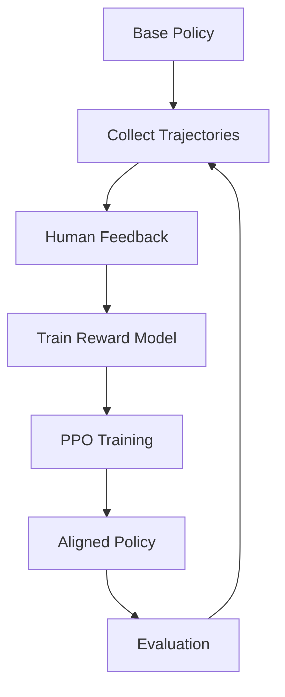

# Tutorial: RLHF Training and Alignment

This tutorial covers Reinforcement Learning from Human Feedback (RLHF) in AInception, enabling agents to learn from human preferences and align with human values.

## Prerequisites

- Complete [Basic Setup](basic_setup.md) and [Advanced Planning](advanced_planning.md) tutorials
- Understanding of reinforcement learning concepts
- NVIDIA GPU strongly recommended for training

## Overview

RLHF in AInception enables:
- **Preference Learning**: Learn from human comparisons of agent behaviors
- **Policy Alignment**: Align agent actions with human values and preferences  
- **Ethical Training**: Incorporate moral feedback into decision-making
- **Continual Learning**: Adapt to new preferences without forgetting old ones

## Step 1: Understanding RLHF Pipeline

The RLHF process in AInception consists of several stages:



Let's implement this step by step:

```python
#!/usr/bin/env python3
"""
RLHF Training Demo
Shows complete pipeline for human feedback learning.
"""

import sys
import os
from pathlib import Path
import numpy as np
import torch
from typing import List, Dict, Any

# Add project root to path
sys.path.insert(0, str(Path(__file__).parent.parent))

from agent.core import Agent
from worlds.gridworld import GridWorld
from viz.rlhf_module import RLHFTrainer, RewardModel, HumanFeedbackCollector
from database import DatabaseManager

class RLHFDemo:
    def __init__(self):
        self.db = DatabaseManager("rlhf_demo.db")
        self.world = GridWorld(width=8, height=8, goal_pos=(7, 7))
        self.feedback_collector = HumanFeedbackCollector()
        self.reward_model = RewardModel()
        self.trainer = RLHFTrainer()
        
    def run_complete_pipeline(self):
        print("🚀 RLHF Training Pipeline Demo")
        
        # Stage 1: Initial Policy Training
        print("\n📈 Stage 1: Training Base Policy")
        base_agent = self.train_base_policy()
        
        # Stage 2: Collect Trajectories
        print("\n📝 Stage 2: Collecting Trajectories")  
        trajectories = self.collect_trajectories(base_agent, num_episodes=50)
        
        # Stage 3: Gather Human Feedback
        print("\n👤 Stage 3: Gathering Human Feedback")
        feedback_data = self.collect_human_feedback(trajectories)
        
        # Stage 4: Train Reward Model
        print("\n🎯 Stage 4: Training Reward Model")
        self.train_reward_model(feedback_data)
        
        # Stage 5: PPO with Learned Rewards
        print("\n⚡ Stage 5: PPO Training with Human Feedback")
        aligned_agent = self.train_with_ppo(base_agent)
        
        # Stage 6: Evaluation
        print("\n📊 Stage 6: Evaluating Aligned Policy")
        self.evaluate_alignment(base_agent, aligned_agent)
        
    def train_base_policy(self) -> Agent:
        """Train initial policy with standard rewards."""
        agent = Agent(enable_journal_llm=False)
        
        print("Training base policy for 100 episodes...")
        for episode in range(100):
            obs = self.world.reset()
            done = False
            episode_reward = 0
            
            while not done:
                result = agent.step(obs)
                obs, reward, done, info = self.world.step(result['action'])
                episode_reward += reward
                
                # Simple reward shaping for base training
                if obs['agent_pos'] == obs['goal']:
                    done = True
                    
            if episode % 20 == 0:
                print(f"Episode {episode}: Reward = {episode_reward:.2f}")
                
        print("✅ Base policy training complete")
        return agent
        
    def collect_trajectories(self, agent: Agent, num_episodes: int) -> List[Dict]:
        """Collect trajectory data for human feedback."""
        trajectories = []
        
        print(f"Collecting {num_episodes} trajectories...")
        
        for episode in range(num_episodes):
            trajectory = {
                "episode_id": episode,
                "states": [],
                "actions": [], 
                "observations": [],
                "justifications": [],
                "drive_states": [],
                "constitution_checks": []
            }
            
            obs = self.world.reset()
            done = False
            
            while not done and len(trajectory["states"]) < 100:
                # Record current state
                trajectory["states"].append(obs['agent_pos'])
                trajectory["observations"].append(obs.copy())
                trajectory["drive_states"].append(agent.get_drive_summary())
                
                # Get agent action
                result = agent.step(obs)
                trajectory["actions"].append(result['action'])
                trajectory["justifications"].append(result['justification'])
                
                # Record constitution check results
                if 'constitution_check' in result.get('logs', {}):
                    trajectory["constitution_checks"].append(result['logs']['constitution_check'])
                
                # Execute action
                obs, reward, done, info = self.world.step(result['action'])
                
                if obs['agent_pos'] == obs['goal']:
                    done = True
                    
            trajectory["success"] = obs['agent_pos'] == obs['goal']
            trajectory["final_drives"] = agent.get_drive_summary()
            trajectories.append(trajectory)
            
            if episode % 10 == 0:
                success_rate = sum(t["success"] for t in trajectories[-10:]) / min(10, len(trajectories))
                print(f"Episode {episode}: Success rate = {success_rate:.1%}")
                
        print(f"✅ Collected {len(trajectories)} trajectories")
        return trajectories
        
    def collect_human_feedback(self, trajectories: List[Dict]) -> List[Dict]:
        """Simulate human feedback collection."""
        print("Collecting human preferences on trajectory pairs...")
        
        # In real implementation, this would show trajectories to humans
        # For demo, we simulate with heuristic preferences
        
        feedback_data = []
        num_comparisons = min(100, len(trajectories) // 2)
        
        for i in range(num_comparisons):
            # Select two trajectories to compare
            traj_a = trajectories[i * 2]
            traj_b = trajectories[i * 2 + 1] if i * 2 + 1 < len(trajectories) else trajectories[0]
            
            # Simulate human preference (in practice, show to human evaluator)
            preference = self.simulate_human_preference(traj_a, traj_b)
            
            feedback_data.append({
                "trajectory_a": traj_a,
                "trajectory_b": traj_b, 
                "preference": preference,  # 0 for A, 1 for B, 0.5 for tie
                "confidence": np.random.uniform(0.7, 1.0),  # Human confidence
                "feedback_type": "trajectory_comparison"
            })
            
            # Also collect scalar feedback on individual trajectories
            scalar_feedback_a = self.simulate_scalar_feedback(traj_a)
            scalar_feedback_b = self.simulate_scalar_feedback(traj_b)
            
            feedback_data.extend([
                {
                    "trajectory": traj_a,
                    "score": scalar_feedback_a,
                    "feedback_type": "scalar_rating"
                },
                {
                    "trajectory": traj_b, 
                    "score": scalar_feedback_b,
                    "feedback_type": "scalar_rating"
                }
            ])
            
        print(f"✅ Collected {len(feedback_data)} feedback items")
        return feedback_data
        
    def simulate_human_preference(self, traj_a: Dict, traj_b: Dict) -> float:
        """Simulate human preference judgment."""
        # Example heuristics for human preferences:
        # 1. Prefer successful trajectories
        # 2. Prefer shorter paths (efficiency)
        # 3. Prefer better drive management
        # 4. Prefer constitutional compliance
        
        score_a = 0.0
        score_b = 0.0
        
        # Success bonus
        if traj_a["success"]:
            score_a += 2.0
        if traj_b["success"]:
            score_b += 2.0
            
        # Efficiency (shorter is better)
        score_a -= len(traj_a["states"]) * 0.01
        score_b -= len(traj_b["states"]) * 0.01
        
        # Drive management (final drives closer to setpoints)
        drives_a = traj_a["final_drives"]
        drives_b = traj_b["final_drives"]
        
        # Assume setpoints: energy=0.7, temperature=0.5, social=0.3
        setpoints = {"energy": 0.7, "temperature": 0.5, "social_proximity": 0.3}
        
        for drive, setpoint in setpoints.items():
            if drive in drives_a:
                score_a -= abs(drives_a[drive] - setpoint)
            if drive in drives_b:
                score_b -= abs(drives_b[drive] - setpoint)
                
        # Constitutional compliance (prefer fewer violations)
        violations_a = sum(1 for check in traj_a.get("constitution_checks", []) 
                          if check.get("violations", []))
        violations_b = sum(1 for check in traj_b.get("constitution_checks", []) 
                          if check.get("violations", []))
        score_a -= violations_a * 0.5
        score_b -= violations_b * 0.5
        
        # Convert to preference probability
        if abs(score_a - score_b) < 0.1:
            return 0.5  # Tie
        elif score_a > score_b:
            return 0.0  # Prefer A
        else:
            return 1.0  # Prefer B
            
    def simulate_scalar_feedback(self, trajectory: Dict) -> float:
        """Simulate scalar rating feedback (0-10 scale)."""
        score = 5.0  # Neutral baseline
        
        # Adjust based on trajectory quality
        if trajectory["success"]:
            score += 2.0
            
        # Penalize very long paths
        if len(trajectory["states"]) > 50:
            score -= 1.0
            
        # Reward good drive management
        final_drives = trajectory["final_drives"]
        setpoints = {"energy": 0.7, "temperature": 0.5, "social_proximity": 0.3}
        
        drive_score = 0
        for drive, setpoint in setpoints.items():
            if drive in final_drives:
                error = abs(final_drives[drive] - setpoint)
                drive_score += max(0, 1.0 - error * 2)  # Better drives = higher score
                
        score += drive_score / len(setpoints)
        
        # Add some noise to simulate human variability
        score += np.random.normal(0, 0.5)
        
        return np.clip(score, 0, 10)
        
    def train_reward_model(self, feedback_data: List[Dict]):
        """Train reward model from human feedback."""
        print("Training reward model on human feedback...")
        
        # Prepare training data
        training_data = self.prepare_reward_training_data(feedback_data)
        
        # Train reward model
        self.reward_model.train(
            training_data,
            epochs=50,
            learning_rate=1e-4,
            batch_size=16
        )
        
        # Evaluate reward model
        accuracy = self.evaluate_reward_model(feedback_data)
        print(f"✅ Reward model training complete. Accuracy: {accuracy:.1%}")
        
    def prepare_reward_training_data(self, feedback_data: List[Dict]) -> Dict:
        """Convert feedback into training format for reward model."""
        comparisons = []
        ratings = []
        
        for item in feedback_data:
            if item["feedback_type"] == "trajectory_comparison":
                # Convert trajectory to feature vector
                features_a = self.trajectory_to_features(item["trajectory_a"])
                features_b = self.trajectory_to_features(item["trajectory_b"])
                
                comparisons.append({
                    "features_a": features_a,
                    "features_b": features_b,
                    "preference": item["preference"],
                    "confidence": item["confidence"]
                })
                
            elif item["feedback_type"] == "scalar_rating":
                features = self.trajectory_to_features(item["trajectory"])
                ratings.append({
                    "features": features,
                    "score": item["score"]
                })
                
        return {
            "comparisons": comparisons,
            "ratings": ratings
        }
        
    def trajectory_to_features(self, trajectory: Dict) -> np.ndarray:
        """Convert trajectory to feature vector for reward model."""
        features = []
        
        # Basic trajectory statistics
        features.append(len(trajectory["states"]))  # Path length
        features.append(float(trajectory["success"]))  # Success
        
        # Drive management features
        final_drives = trajectory["final_drives"]
        setpoints = {"energy": 0.7, "temperature": 0.5, "social_proximity": 0.3}
        
        for drive, setpoint in setpoints.items():
            if drive in final_drives:
                features.append(final_drives[drive])  # Final drive value
                features.append(abs(final_drives[drive] - setpoint))  # Drive error
            else:
                features.extend([0.0, 1.0])  # Missing drive penalty
                
        # Constitutional compliance
        violations = sum(1 for check in trajectory.get("constitution_checks", []) 
                        if check.get("violations", []))
        features.append(violations)
        
        # Spatial features
        if trajectory["states"]:
            start_pos = trajectory["states"][0]
            end_pos = trajectory["states"][-1] 
            features.extend([start_pos[0], start_pos[1], end_pos[0], end_pos[1]])
        else:
            features.extend([0, 0, 0, 0])
            
        return np.array(features, dtype=np.float32)
        
    def evaluate_reward_model(self, feedback_data: List[Dict]) -> float:
        """Evaluate reward model accuracy on human feedback."""
        correct_predictions = 0
        total_predictions = 0
        
        for item in feedback_data:
            if item["feedback_type"] == "trajectory_comparison":
                features_a = self.trajectory_to_features(item["trajectory_a"])
                features_b = self.trajectory_to_features(item["trajectory_b"])
                
                reward_a = self.reward_model.predict_reward(features_a)
                reward_b = self.reward_model.predict_reward(features_b)
                
                # Check if model preference matches human preference
                if item["preference"] == 0.0:  # Human prefers A
                    if reward_a > reward_b:
                        correct_predictions += 1
                elif item["preference"] == 1.0:  # Human prefers B
                    if reward_b > reward_a:
                        correct_predictions += 1
                else:  # Tie
                    if abs(reward_a - reward_b) < 0.1:
                        correct_predictions += 1
                        
                total_predictions += 1
                
        return correct_predictions / total_predictions if total_predictions > 0 else 0.0
        
    def train_with_ppo(self, base_agent: Agent) -> Agent:
        """Train agent with PPO using learned reward model."""
        print("Training with PPO using learned rewards...")
        
        # Configure PPO trainer
        ppo_config = {
            "learning_rate": 3e-4,
            "batch_size": 64,
            "epochs_per_update": 10,
            "clip_range": 0.2,
            "entropy_coeff": 0.01,
            "kl_target": 0.01
        }
        
        aligned_agent = Agent(enable_journal_llm=False)
        
        # PPO training loop
        for update in range(50):  # 50 PPO updates
            # Collect rollouts
            rollouts = self.collect_rollouts_with_learned_rewards(aligned_agent, episodes=10)
            
            # Update policy
            policy_loss = self.trainer.ppo_update(aligned_agent, rollouts, ppo_config)
            
            if update % 10 == 0:
                avg_reward = np.mean([r["total_reward"] for r in rollouts])
                print(f"Update {update}: Policy Loss = {policy_loss:.4f}, Avg Reward = {avg_reward:.2f}")
                
        print("✅ PPO training with human feedback complete")
        return aligned_agent
        
    def collect_rollouts_with_learned_rewards(self, agent: Agent, episodes: int) -> List[Dict]:
        """Collect rollouts using learned reward model."""
        rollouts = []
        
        for episode in range(episodes):
            rollout = {
                "states": [],
                "actions": [],
                "rewards": [],
                "log_probs": [],
                "values": [],
                "total_reward": 0
            }
            
            obs = self.world.reset()
            done = False
            
            while not done and len(rollout["states"]) < 100:
                # Record state
                rollout["states"].append(obs.copy())
                
                # Get agent action
                result = agent.step(obs)
                action = result['action']
                rollout["actions"].append(action)
                
                # Compute learned reward
                trajectory_features = self.trajectory_to_features({
                    "states": [obs['agent_pos']],
                    "success": obs['agent_pos'] == obs['goal'],
                    "final_drives": agent.get_drive_summary(),
                    "constitution_checks": []
                })
                
                learned_reward = self.reward_model.predict_reward(trajectory_features)
                rollout["rewards"].append(learned_reward)
                rollout["total_reward"] += learned_reward
                
                # Execute action
                obs, env_reward, done, info = self.world.step(action)
                
                if obs['agent_pos'] == obs['goal']:
                    done = True
                    
            rollouts.append(rollout)
            
        return rollouts
        
    def evaluate_alignment(self, base_agent: Agent, aligned_agent: Agent):
        """Evaluate how well aligned agent matches human preferences."""
        print("Evaluating alignment quality...")
        
        # Run both agents on same test scenarios  
        test_scenarios = []
        for _ in range(20):
            test_scenarios.append(self.world.reset())
            
        base_results = []
        aligned_results = []
        
        for scenario in test_scenarios:
            # Test base agent
            base_traj = self.run_agent_episode(base_agent, scenario)
            base_results.append(base_traj)
            
            # Test aligned agent  
            aligned_traj = self.run_agent_episode(aligned_agent, scenario)
            aligned_results.append(aligned_traj)
            
        # Compare results
        base_human_scores = [self.simulate_scalar_feedback(traj) for traj in base_results]
        aligned_human_scores = [self.simulate_scalar_feedback(traj) for traj in aligned_results]
        
        print(f"Base Agent - Avg Human Score: {np.mean(base_human_scores):.2f} ± {np.std(base_human_scores):.2f}")
        print(f"Aligned Agent - Avg Human Score: {np.mean(aligned_human_scores):.2f} ± {np.std(aligned_human_scores):.2f}")
        
        # Statistical significance test
        from scipy import stats
        t_stat, p_value = stats.ttest_rel(aligned_human_scores, base_human_scores)
        
        if p_value < 0.05:
            print(f"✅ Alignment significantly improved human preference scores (p={p_value:.4f})")
        else:
            print(f"⚠️  No significant improvement in human preference scores (p={p_value:.4f})")
            
    def run_agent_episode(self, agent: Agent, initial_obs: Dict) -> Dict:
        """Run single episode with agent."""
        trajectory = {
            "states": [],
            "actions": [],
            "justifications": [],
            "success": False,
            "final_drives": {}
        }
        
        obs = initial_obs.copy()
        done = False
        
        while not done and len(trajectory["states"]) < 100:
            trajectory["states"].append(obs['agent_pos'])
            
            result = agent.step(obs)
            trajectory["actions"].append(result['action'])
            trajectory["justifications"].append(result['justification'])
            
            obs, reward, done, info = self.world.step(result['action'])
            
            if obs['agent_pos'] == obs['goal']:
                trajectory["success"] = True
                done = True
                
        trajectory["final_drives"] = agent.get_drive_summary()
        return trajectory

def main():
    demo = RLHFDemo()
    demo.run_complete_pipeline()

if __name__ == "__main__":
    main()
```

Save this as `rlhf_training_demo.py` and run it:

```bash
python rlhf_training_demo.py
```

## Step 2: Advanced RLHF Techniques

### Constitutional AI Integration
```python
class ConstitutionalRLHF(RLHFTrainer):
    def __init__(self, constitution: Constitution):
        super().__init__()
        self.constitution = constitution
        
    def compute_constitutional_reward(self, trajectory: Dict) -> float:
        """Add constitutional compliance to reward."""
        base_reward = self.reward_model.predict_reward(trajectory)
        
        # Check constitutional violations
        violations = 0
        for action in trajectory["actions"]:
            check_result = self.constitution.evaluate(action)
            violations += len(check_result.get("violations", []))
            
        # Heavy penalty for violations
        constitutional_penalty = violations * 10.0
        
        return base_reward - constitutional_penalty
```

### Multi-Task RLHF
```python
class MultiTaskRLHF:
    def __init__(self, task_types: List[str]):
        self.reward_models = {}
        for task in task_types:
            self.reward_models[task] = RewardModel(task_specific=True)
            
    def train_task_specific_rewards(self, feedback_by_task: Dict):
        """Train separate reward models for different task types."""
        for task, feedback in feedback_by_task.items():
            print(f"Training reward model for task: {task}")
            self.reward_models[task].train(feedback)
            
    def compute_multitask_reward(self, trajectory: Dict, task_type: str) -> float:
        """Compute task-specific reward."""
        return self.reward_models[task_type].predict_reward(trajectory)
```

### Online RLHF
```python
class OnlineRLHF:
    def __init__(self):
        self.feedback_buffer = []
        self.reward_model = RewardModel()
        self.update_frequency = 50  # Update every N trajectories
        
    def collect_online_feedback(self, trajectory: Dict) -> Dict:
        """Collect real-time human feedback."""
        # In practice, this would show trajectory to human
        feedback = {
            "trajectory": trajectory,
            "rating": self.get_human_rating(trajectory),
            "timestamp": time.time()
        }
        
        self.feedback_buffer.append(feedback)
        
        # Update model if enough new feedback
        if len(self.feedback_buffer) >= self.update_frequency:
            self.update_reward_model()
            self.feedback_buffer = []
            
        return feedback
        
    def update_reward_model(self):
        """Incrementally update reward model."""
        print("Updating reward model with new feedback...")
        self.reward_model.incremental_update(self.feedback_buffer)
```

## Step 3: Evaluation and Analysis

### Human Preference Prediction
```python
def analyze_preference_alignment(model_predictions: List[float], 
                               human_preferences: List[float]) -> Dict:
    """Analyze how well model aligns with human preferences."""
    from scipy.stats import pearsonr, spearmanr
    from sklearn.metrics import mean_absolute_error, mean_squared_error
    
    # Correlation analysis
    pearson_r, pearson_p = pearsonr(model_predictions, human_preferences)
    spearman_r, spearman_p = spearmanr(model_predictions, human_preferences)
    
    # Error metrics
    mae = mean_absolute_error(human_preferences, model_predictions)
    mse = mean_squared_error(human_preferences, model_predictions)
    rmse = np.sqrt(mse)
    
    return {
        "pearson_correlation": pearson_r,
        "pearson_p_value": pearson_p,
        "spearman_correlation": spearman_r, 
        "spearman_p_value": spearman_p,
        "mean_absolute_error": mae,
        "root_mean_squared_error": rmse,
        "alignment_quality": "excellent" if pearson_r > 0.8 else 
                           "good" if pearson_r > 0.6 else
                           "moderate" if pearson_r > 0.4 else "poor"
    }
```

### Distributional Preferences
```python
class DistributionalRLHF:
    """Handle uncertainty in human preferences."""
    
    def __init__(self, num_reward_models: int = 5):
        self.reward_models = [RewardModel() for _ in range(num_reward_models)]
        
    def train_ensemble(self, feedback_data: List[Dict]):
        """Train ensemble of reward models."""
        # Bootstrap sampling for diversity
        for i, model in enumerate(self.reward_models):
            bootstrap_data = np.random.choice(
                feedback_data, 
                size=len(feedback_data), 
                replace=True
            ).tolist()
            model.train(bootstrap_data)
            
    def predict_reward_distribution(self, trajectory: Dict) -> Dict:
        """Get reward prediction with uncertainty."""
        predictions = []
        for model in self.reward_models:
            reward = model.predict_reward(trajectory)
            predictions.append(reward)
            
        return {
            "mean": np.mean(predictions),
            "std": np.std(predictions),
            "predictions": predictions,
            "confidence": 1.0 / (1.0 + np.std(predictions))  # Simple confidence
        }
```

## Step 4: Best Practices

### Collecting Quality Feedback
```python
def collect_high_quality_feedback():
    """Guidelines for collecting good human feedback."""
    
    best_practices = {
        "trajectory_selection": [
            "Show diverse behaviors",
            "Include both successes and failures", 
            "Present meaningful differences",
            "Avoid overwhelming complexity"
        ],
        
        "presentation": [
            "Clear visualization of agent behavior",
            "Highlight key decision points",
            "Show consequences of actions",
            "Provide relevant context"
        ],
        
        "feedback_interface": [
            "Simple comparison interface",
            "Allow confidence ratings",
            "Enable explanatory comments",
            "Support different feedback types"
        ],
        
        "quality_control": [
            "Multiple annotators per comparison",
            "Consensus mechanisms", 
            "Qualification tests",
            "Regular calibration checks"
        ]
    }
    
    return best_practices
```

### Reward Model Validation  
```python
def validate_reward_model(reward_model: RewardModel, 
                         validation_set: List[Dict]) -> Dict:
    """Comprehensive reward model validation."""
    
    # Preference accuracy
    correct_preferences = 0
    total_preferences = 0
    
    # Calibration analysis
    confidence_bins = [[] for _ in range(10)]
    accuracy_bins = [[] for _ in range(10)]
    
    for item in validation_set:
        if item["feedback_type"] == "trajectory_comparison":
            features_a = trajectory_to_features(item["trajectory_a"])
            features_b = trajectory_to_features(item["trajectory_b"])
            
            reward_a = reward_model.predict_reward(features_a)
            reward_b = reward_model.predict_reward(features_b)
            
            # Check preference accuracy
            model_prefers_a = reward_a > reward_b
            human_prefers_a = item["preference"] == 0.0
            
            if model_prefers_a == human_prefers_a:
                correct_preferences += 1
            total_preferences += 1
            
            # Calibration analysis
            confidence = abs(reward_a - reward_b)
            bin_idx = min(int(confidence * 10), 9)
            confidence_bins[bin_idx].append(confidence)
            accuracy_bins[bin_idx].append(int(model_prefers_a == human_prefers_a))
    
    # Compute metrics
    preference_accuracy = correct_preferences / total_preferences
    
    # Expected Calibration Error (ECE)
    ece = 0.0
    for i in range(10):
        if len(confidence_bins[i]) > 0:
            bin_accuracy = np.mean(accuracy_bins[i])
            bin_confidence = np.mean(confidence_bins[i])
            bin_size = len(confidence_bins[i]) / total_preferences
            ece += bin_size * abs(bin_accuracy - bin_confidence)
    
    return {
        "preference_accuracy": preference_accuracy,
        "expected_calibration_error": ece,
        "total_comparisons": total_preferences,
        "well_calibrated": ece < 0.1
    }
```

## Step 5: Advanced Applications

### Safe Exploration with RLHF
```python
class SafeRLHF:
    """RLHF with safety constraints."""
    
    def __init__(self, safety_model: RewardModel):
        self.safety_model = safety_model
        self.safety_threshold = -1.0  # Minimum safety score
        
    def safe_policy_update(self, agent: Agent, rollouts: List[Dict]) -> Agent:
        """Only update policy with safe trajectories."""
        
        safe_rollouts = []
        for rollout in rollouts:
            safety_score = self.safety_model.predict_reward(rollout)
            
            if safety_score >= self.safety_threshold:
                safe_rollouts.append(rollout)
            else:
                print(f"Filtering unsafe rollout (safety={safety_score:.3f})")
                
        # Only update if we have enough safe data
        if len(safe_rollouts) >= len(rollouts) * 0.5:
            return self.trainer.ppo_update(agent, safe_rollouts)
        else:
            print("Not enough safe rollouts for update")
            return agent
```

### Continual RLHF
```python
class ContinualRLHF:
    """RLHF with continual learning to prevent forgetting."""
    
    def __init__(self):
        self.experience_replay = []
        self.ewc_lambda = 1000.0  # Elastic Weight Consolidation strength
        
    def continual_update(self, new_feedback: List[Dict]):
        """Update while preserving old knowledge."""
        
        # Store old parameters for EWC
        old_params = copy.deepcopy(self.reward_model.parameters())
        
        # Compute Fisher Information Matrix on old tasks
        fisher_info = self.compute_fisher_information()
        
        # Train on new data with EWC regularization
        self.reward_model.train_with_ewc(
            new_feedback, 
            old_params, 
            fisher_info, 
            self.ewc_lambda
        )
        
        # Add to replay buffer
        self.experience_replay.extend(new_feedback)
        
        # Periodic replay of old experiences
        if len(self.experience_replay) > 1000:
            replay_batch = random.sample(self.experience_replay, 100)
            self.reward_model.train(replay_batch)
```

## Troubleshooting

### Common RLHF Issues

**Reward Hacking**
```python
def detect_reward_hacking(trajectories: List[Dict], 
                         reward_model: RewardModel) -> List[Dict]:
    """Detect potential reward hacking behaviors."""
    
    suspicious_trajectories = []
    
    for traj in trajectories:
        predicted_reward = reward_model.predict_reward(traj)
        
        # Check for suspicious patterns
        if (predicted_reward > 9.0 and  # Very high reward
            not traj.get("success", False)):  # But task failed
            
            suspicious_trajectories.append({
                "trajectory": traj,
                "predicted_reward": predicted_reward,
                "reason": "high_reward_no_success"
            })
            
    return suspicious_trajectories
```

**Distribution Shift**
```python
def monitor_distribution_shift(current_trajectories: List[Dict],
                             reference_trajectories: List[Dict]) -> float:
    """Monitor for distribution shift in agent behavior."""
    
    # Extract feature distributions
    current_features = [trajectory_to_features(t) for t in current_trajectories]
    reference_features = [trajectory_to_features(t) for t in reference_trajectories]
    
    # Compute KL divergence or Wasserstein distance
    from scipy.stats import wasserstein_distance
    
    shift_scores = []
    for dim in range(len(current_features[0])):
        current_dim = [f[dim] for f in current_features]
        reference_dim = [f[dim] for f in reference_features]
        
        shift = wasserstein_distance(current_dim, reference_dim)
        shift_scores.append(shift)
    
    return np.mean(shift_scores)
```

## Next Steps

Explore related advanced topics:
- [Multi-Agent Social Interactions](multi_agent.md)
- [Custom World Environments](custom_worlds.md) 
- [Constitutional AI Deep Dive](constitutional_ai.md)

## Resources

- [InstructGPT Paper](https://arxiv.org/abs/2203.02155)
- [Constitutional AI Paper](https://arxiv.org/abs/2212.08073)
- [RLHF Survey](https://arxiv.org/abs/2303.15025)

---

**Congratulations!** You've mastered RLHF in AInception. You can now train agents that align with human values and preferences, creating more trustworthy and beneficial autonomous systems. 🤖✨